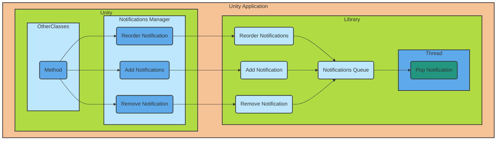

# UnityNotificationManager
A library for Unity Android to use local push notifications.

## How It Works

The functioning is kind of explained here. This is more like a test to see if GitHub reads mermaid.

